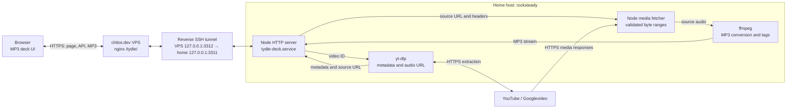
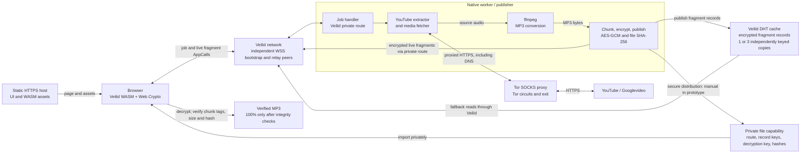
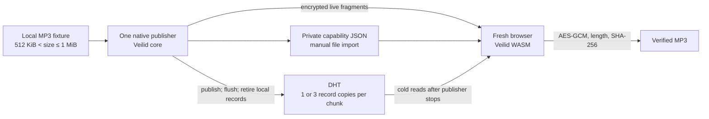

# MP3 deck architecture

Updated 2026-10-06. The Tor/Veilid design is proposed, not deployed.

## Current hosted app

The public VPS forwards requests over the home host's existing reverse SSH
tunnel. Extraction, media fetching, and conversion run on the home host.
The HTTP response carries MP3 bytes back along that same path.

The live configuration selects yt-dlp through `YT_DLP_PATH`; the WASM
`TydleClient` extraction path remains available when that variable is unset.
YouTube sees the home network's public egress IP. The browser buffers the MP3,
offers the file after the response completes successfully, and then shows 100%.
There is currently no Tor routing, Veilid delivery, or shared MP3 cache.

## Proposed Tor + Veilid architecture

This diagram extends the local `veilid-cache-prototype.md` specification:
Tor handles the worker's outbound YouTube requests, while Veilid handles
encrypted delivery and cache reads. The worker, job protocol, Tor integration,
and capability distribution are future work. Veilid traffic is not implicitly
routed through Tor.

YouTube would see a Tor exit IP for correctly proxied worker requests. Tor exits
may still be rejected by YouTube; this design does not promise successful
extraction. Keep extraction and media fetching on a compatible Tor exit/session.
There is no automatic fallback to the home IP in this proposed flow.

DHT copies are a cache, not a durability guarantee. Different record keys do
not prove independent storage hosts. If the publisher is offline and every
copy is unavailable, show a cache miss. A later repair or regeneration workflow
would need its own implementation.

## First prototype boundary

The specified first experiment deliberately uses a local MP3 fixture. It proves
live transfer and cold DHT retrieval after stopping the publisher before adding
YouTube, Tor, ffmpeg, discovery, multiple publishers, or automated retention.

The static page and independent bootstrap/relay peers must remain reachable
during the publisher-shutdown test. Only a verified complete file is saved.
