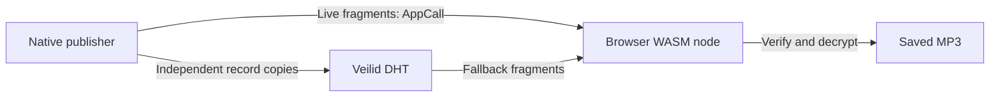

# Veilid MP3 cache: minimum prototype

Status: specification only. Date: 2026-10-04.

Prove that a fresh browser can reconstruct an MP3 from Veilid DHT records after
the publishing node stops. Compare one record copy with three independently
keyed copies. The hypothesis is that separate record keys improve cache
availability by targeting different DHT neighborhoods; this experiment does not
assume that their storage peers are disjoint.

**Smallest deliverable.** One native Rust publisher using `veilid-core`, one static
browser page using `veilid-wasm`, and one local MP3 fixture. Pin both Veilid
components to the same 0.5.7 release/build and commit dependency lockfiles. The
publisher offers `--copies 1` and `--copies 3`; all copies come from that one node.
Use an MP3 larger than 512 KiB and no larger than 1 MiB, forcing two logical chunks.
The fixture is immutable for each run.

The browser page is served independently from the publisher. HTTPS and reachable
WSS bootstrap/relay peers are prerequisites. At least one usable browser relay
must remain reachable when the publisher stops. Establish a real browser/native
AppCall and browser DHT read before the file experiment. A relay/bootstrap hosted
inside the publisher process would invalidate the shutdown test.



The first cut uses the fixture as its source. Tor, YouTube extraction, ffmpeg,
multiple publishing nodes, a DHT catalog, OPFS, autonomous seeders, retention
leases, repair, and erasure coding follow a successful cache experiment.

**Data layout.** Split the source into 512 KiB plaintext chunks; the final chunk
is shorter. Generate a fresh 256-bit AES-GCM key and random 128-bit file ID per
run. Encrypt each chunk with a unique random 12-byte nonce and a 128-bit tag.
Use UTF-8 `v1|<file_id_hex>|<chunk_index_decimal>|<plaintext_bytes_decimal>` as
authenticated additional data. Encrypt a chunk once for publication and reuse
that ciphertext across its record copies. Use established crypto libraries and
browser Web Crypto.

Split ciphertext into fragments of at most 16,384 bytes. For each chunk, create
one or three DFLT records with fresh owner keypairs. Allocate
`ceil(ciphertext_bytes / 16384)` subkeys; subkey `j` holds fragment `j`. A full
chunk produces 524,304 ciphertext bytes and 33 subkeys. Each copy has a different
record key but the same application ciphertext. This stays comfortably below
the 32 KiB subkey and 1 MiB record limits. Subkeys in one record share its
placement coordinate. [DHT structure](https://veilid.gitlab.io/developer-book/concepts/dht.html),
[subkey limit](https://docs.rs/veilid-core/latest/veilid_core/struct.ValueData.html)

Hand the browser a private capability JSON file through a file picker. Its fields
are:

```text
version: 1
file_id: 32 lowercase hexadecimal characters
filename: fixture.mp3
file_bytes: integer
file_sha256: 64 lowercase hexadecimal characters
aes_key_b64: base64 of 32 bytes
fragment_bytes: 16384
live_route_blob_b64: exported Veilid private-route blob
chunks[]:
  index: integer
  plaintext_bytes: integer
  ciphertext_bytes: integer
  nonce_b64: base64 of 12 bytes
  record_keys[]: complete SDK read capabilities, one per copy
```

Preserve any record encryption material contained in the SDK's read capability;
omit owner/writer secrets. The capability is trusted input for this prototype.
Write it with mode 0600 into an ignored runtime directory. Keep capabilities,
file keys, route blobs, and record keys out of URLs and ordinary logs. Metadata
distribution is manual; it requires no catalog service.

**Publisher behavior.** Read, encrypt, and publish one chunk at a time, with at
most four DHT operations in flight. Complete each record's writes, await
`flush_dht_record` with a 60-second timeout, and inspect all populated subkeys with
`SyncSet`. Require no pending offline writes and network sequence numbers matching
the expected local versions. Abort publication if these checks fail; only emit
the final capability after every chunk passes.

After those checks, close and delete each locally authored chunk record before
advancing to the next chunk. This removes its local record storage and ends this
node's refresh responsibility without deleting network copies. Neither a
successful set nor a flush alone proves future retention. [Publication and
cleanup APIs](https://docs.rs/veilid-core/0.5.7/veilid_core/struct.RoutingContext.html)

Keep application-owned payload buffers below 2 MiB, excluding Veilid's internal
heap. At most one chunk's record set may remain in the publisher's local store;
no authored chunk records remain after publication. Report actual local database
file size separately: deleting records does not establish physical file
compaction. Retain only the capability, input fixture, and one bounded live
chunk buffer. The fixture deliberately supplies live reads; this prototype does
not yet prove bounded storage during YouTube conversion.

For live delivery, allocate and export a private route after publication and
retain default sender safety.
Serve the following JSON AppCall request:

```json
{"v":1,"file_id":"<file_id_hex>","chunk":0,"fragment":0}
```

Respond with byte `0x00` followed by the requested ciphertext fragment, or byte
`0x01` for an invalid request. Validate the file ID and integer bounds. Generate
live fragments from the immutable fixture using its recorded encryption
parameters and one chunk buffer. Requests and responses fit the 32 KiB AppCall
limit. [AppCall API](https://docs.rs/veilid-core/0.5.7/veilid_core/struct.RoutingContext.html#method.app_call)

**Browser behavior.** The page has a capability file picker, Download button,
progress, and a final result showing live/DHT bytes and elapsed time. Import the
private route and request live fragments. A live request failure switches the
remaining download to DHT retrieval; use SDK RPC deadlines rather than repeatedly
probing a dead publisher.

For each DHT chunk, try record copies in manifest order. Open records read-only
and use `get_dht_value(..., force_refresh=true)`. Assemble the expected fragments;
reject missing values and incorrect lengths. If retrieval or authenticated
decryption fails, discard that attempt and try the next record. Bound concurrent
fragment reads to four. Exhausting all copies fails the download.

Verify each chunk with AES-GCM, then the reconstructed file's length and SHA-256.
Only then offer the MP3 as a Blob download and show 100%. A failed download offers
no partial file. For this small fixture, keeping the final file in browser memory
is sufficient.

**Acceptance runs.** Use fresh publication keys for every trial. For each cold
retrieval, use an empty browser profile or equivalent isolated Veilid storage;
reloading the page does not clear its local DHT cache. Keep the static page and
independent networking infrastructure available throughout.

| Run | Procedure | Required evidence |
| --- | --- | --- |
| Live | Publish three copies; download while the publisher runs. | Live bytes are nonzero; output length and SHA-256 match. |
| Cold DHT | Publish; stop the publisher before a fresh browser requests any file data. Run once with one copy and once with three. | With an available network copy, download finishes with zero live bytes and the expected SHA-256. Record failures as real cache misses. |
| Replica fallback | After a three-copy publication and shutdown, remove the first copy from every chunk's capability list; use fresh browser storage. | Retrieval succeeds from a remaining copy when available. This tests alternate-key retrieval, not an actual storage-node outage. |
| Integrity failure | Change one chunk nonce in a private test capability. | Decryption fails and no file is offered. |
| Local retirement | Observe publication and record cleanup. | Buffer bound holds; completed chunks leave no authored records locally. |

Record copy count, publication duration, retirement count, peak application buffer
bytes, cold retrieval delay, download duration, live/DHT bytes, and hash-match
result. SDK record reports expose sequence state, not a census of independent
physical storage hosts. [Record report](https://docs.rs/veilid-core/latest/veilid_core/struct.DHTRecordReport.html)

Immediate cold retrieval establishes feasibility. To explore retention, repeat
one-copy and three-copy trials with fresh keys and a first read delayed by ten
minutes; leave publishers stopped and perform no intervening reads or refreshes.
Keep this manual initially. A few trials cannot establish a retention guarantee
or quantify the redundancy benefit.

**Implementation footprint.** Add an isolated `cache-probe/` with `Cargo.toml`,
`Cargo.lock`, `src/main.rs`, `web/index.html`, `web/client.js`, pinned WASM assets,
and a short README. Ignore `run/` for fixture, capabilities, node state, and logs.
The native command accepts input, copy count, capability output, and Veilid
configuration. Reuse Veilid bindings directly; no ShadowPeer coordinator or
WebRTC/TURN layer is required for this experiment.

The completion result is a reproducible live transfer and a genuine cold DHT
transfer after publisher shutdown, with verified output and local record
retirement. Failure to retain a retrievable DHT copy is an experimental finding;
it must remain visible and must not trigger an HTTP or origin-file fallback.
